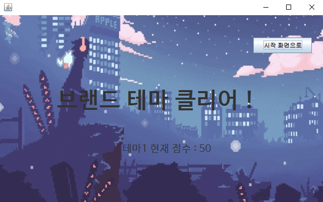
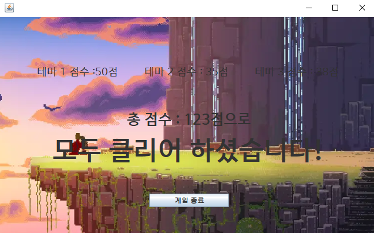

# ERICA_ChoSung

What is **ChoSung**?
--------------------

**ChoSung** means the consonant, the first sound in the composition of the syllable.

In other words, **ChoSung** refers to initial sound.

**ChoSung**이란 무엇인가?
---------------------------

**ChoSung**이란 음절의 구성에서 처음 소리인 자음을 의미한다.

즉, **ChoSung**은 초성을 의미한다.

  
## [제작 기획 정리]

1. **게임 이름**: 초성 퀴즈 게임

2. **게임 장르**: 단어, 퀴즈

3. **사용 언어**: JAVA

4. **사용 통합 개발 환경**: Ubuntu 18.04, Visual code 1.41.1,   Eclipse IDE 4.12.0

5. **개발자 정보**: 소프트웨어학부 2019000773 이성민 (1명)

6. **게임 시안**:  
#

7. **게임 방법**: 어떤 단어의 초성이 주어지면, 개발자가 지정해 놓은 단어로 답을 입력하여 점수를 획득하세요

8. **게임 룰**: 문제를 맞춘 경우 +10점, 틀린 경우 -5점, 힌트 1 사용시 -3점, 힌트 2 사용시 -5점, 힌트 3 사용시 -7점 입니다 (힌트를 적절히 사용해 보세요)

9. **게임 실행 화면**:
#

  
## [개발 기록 일지]
  
- **기록 이전**
>자바 GUI가 처음이라 구글링을 통한 공부를 하였다. "맨 땅에 해딩"하는 격으로 시작하느라 공부하는데 시간을 많이 소비했다. (-자바 교수님께 자문도 구해보면서 해답을 얻고, 많이 부족한 만큼 열심히 노력하게 되었다!)

- **11.24.일**
>자바 GUI를 실행할 수 있게 도와주는 클래스 파일이 자동으로 생성되었고, 간단한 뼈대 코드로 GUI를 실행할 수 있는지 확인하였다.

- **11.25.월**
>본격적으로, 버튼 기능이 잘 작용하는지 그리고 다음 페이지로 잘 넘어가는지 유의하며 게임 시작 화면 및 게임 진행 화면을 활성화하였다.

- **11.26.화 ~ 11.27.수**
>게임 시작 화면에서 연결될 수 있는 페이지들(게임 화면, 게임 설명)을 만들었다. 저장소를 만들 때, README.md파일을 만들었어야 했는데 그렇지 못해 중간에 만들게 되었다. 중간에 만들면서, pull을 하지 않고 push를 했더니 commit이 하나씩 밀리는 경우가 발생해 애를 먹었다. (다음에는 꼭 조심해야겠다.)

- **11.28.목**
>올해 자바를 처음 배우고, 직접 구글링하면서 공부한 보람이 있는 것 같다. GUI가 생각보다 구현이 잘되어서 뿌듯하다. (특히, 버튼 인식 부분에 확실히 알아가는 계기가 되었다.)

- **11.29.금 ~ 12.1.일**
>원래 프로젝트 계획에서 힌트 요소를 추가할 생각을 하지 못했다. 개발 과정 중에 생각이 난 아이디어라 급하게 공부할 필요가 있었다. 자바 스윙에서 팝업창을 띄워주는 JOptionPane 클래스를 사용하여 힌트 요소를 구현하였다.

- **12.2.월**
>게임 방법에 대해 상세하게 설명해 주고, 룰에 대한 기준도 잡아 주었다. (그러나, 룰에 대한 기준은 차후에 변경될 가능성이 높을 것 같다.) JPanel을 사용하면서 불편한 점을 발견하였는데, 긴 문장을 작성하게 되면 그 문장 모두가 보이지 않게 되는 오류를 발견했다. 이러한 해결 방법을 찾다보니, 특이하게도 HTML이라는 단어를 사용하여 줄바꿈을 해 주는 방법이 있었다. 덕분에 금방 해결하였고 앞으로의 개발에 유용한 기능이 될 것 같다. (참고 홈페이지 : <https://src-bin.com/ko/q/1c1c2f>)

- **12.3.화**
>새로운 테마를 제작하는 과정에서, 변수 이름이 헷갈리기 시작하면서 코드가 살짝 꼬여 힘들었다. 뜨면 안되는 페이지가 나오면서 페이지끼리 겹치는 상황이 발생했다. setVisible 메소드를 사용하여 해결하였다. 한편으로, 앞으로의 개발이 걱정된다. 코드가 길어짐에 따라 복잡해지기 시작했고 그만큼 가독성이 떨어지는 듯하다. 좀 더 효율적인 코드를 고려해 보아야겠다.

- **12.4.수**
>보고서 작성을 하기위해 README파일만 수정하였다. 진행하는 프로젝트가 게임인 만큼, 상세한 설명이 필요하다고 느껴졌다. 구글링을 통한 마크다운 문법을 살펴보고 어떤 형식으로 써야할지 확실하게 감을 잡게 되었다. (게임 개발 환경 등 설명)

- **12.5.목**
>프로젝트에 라이센스도 명시해두면 좋을 것 같아 라이센스 파일을 추가하였다. GNU 라이센스가 제일 많이 사용하는 것이라고 하지만, 나는 조금 무겁게 느껴져서 간단한 MIT 라이센스를 선택하였다. 라이센스와 저작권 관련 명시만 지켜주기만 해도 충분한 프로젝트라고 판단했다.

- **12.6.금**
>테마 별로 문제를 최소 5개씩 만들 계획을 지키려, 브랜드 테마에 문제를 추가하였다. 아직까지는 문제를 추가하는데 있어 큰 오류는 없는 듯하다.

- **12.7.토**
>어제와 마찬가지로 문제를 추가하였다. 주석에 신경써야 할 필요를 느꼈고, 변수 이름이 비슷하므로 유의해야겠다. (시험이 코앞이라 개발 진전이 느리다...)

- **12.8.일**
>게임 제작 예정대로, 테마에 있는 문제를 모두 클리어시 끝났다는 창을 띄어주고 시작 화면으로 돌아갈 수 있도록 버튼을 활성화하였다. 구상했던 방식대로 꾸준하게 제작하고 있다^^*(얏호!)

- **12.9.월**
>너무 쉽게 풀린다했더니 역시나, 예상하지 못한 일이 발생했다. JPanel에 이미지를 넣는 것이 쉬운 편일 것이라 생각했는데, 알고보니 매우 까다로운 일이였다. (사전 조사했을 때는, 이미지를 아이콘에 넣는 것은 쉬웠던 편이라 만만하게 본 나의 큰 착각이였다...) 공부와 생각을 병행하려면 좀 많은 시간이 소요될 것 같은 불길한 느낌이 든다 :(

- **12.10.화**
>어제 작업하던 것을 좀 더 공부하였다. 그런데 결국 해답을 찾지 못했다. 코드를 갈아 엎어야 할 가능성이 높아졌다. 좀 막막한 상황인데 포기하고 싶지는 않다 ㅠㅠ 좀 만 더 고민해보고 찾아보면 그래도 해결할 수 있을 거라 믿는다.. 미래의 나야.. :(

- **12.11.수**
>드디어 배경 화면으로 넣는 것을 해결했다. 살짝의 꼼수(?)가 들어간 느낌이라, 솔직히 만족스러운 결과는 아니다. 그래도 어찌됐던 무보단 유가 좋다고 생각한다. 이렇게 삽질을 하다보면 더 좋은 방법이 생각나지 않을까 하는 바람이다...제발ㅠㅠ 그래도 시험기간에 이렇게 1-2시간 공을 들이는 게 보람이 있었으면 좋겠다..!

- **12.12.목**
>어제 한 건 한 기념으로..ㅋㅋ배경을 넣는 방법을 알았으니, 게임 문제를 더 추가하여 완성도를 높이는 중이다! 벌써 코드가 1000줄이 넘어가는데 처음부터 클래스를 나누지 못해 내 무식함에 한탄 중이다 '^' 앞으로 또 자바 GUI를 할 수 있는 계기가 된다면, 좀 더 효율적으로 만들고 싶은 욕심이 마구 마구 생긴다...!

- **12.13.금**
>게임 배경이 단일하고 딱딱한 것보다, 생동감 있는 배경이 더 좋을 것 같아서 혹시 gif형도 가능할까라는 생각으로 적용해 보았다. ㅎㅎ 다행히 적용이 잘 되었고, 구체적으로 알아본 결과, "jpg, png, gif" 이 정도는 지원이 가능한 것으로 잘 알려져 있는 듯 하다.

- **12.14.토**
>오늘은 무난하게, 게임 문제를 추가하였다. 생각보다 단어도 정하기 힘들고 그에 맞는 힌트를 어떻게 주어야 할지 난감하다. 이것이 개발자들의 힘듦일까..ㅠㅠ벌써 이렇게 쉬운 것 가지고 힘들어 하는 내가 조금은 부끄럽다..ㅠㅠ그만큼 열심히 꾸준히 발전해나가야 좋은 개발자가 될 수 있을 것 같다..! 파이팅:)

- **12.15.일**
>난이도가 적절하고 좋은 문제를 내기란 쉽지 않은 것 같다. 그래서 생각하는 건 약간 뒤로 미루고 코드에 대한 틀만 먼저 짜서 테마 두 번째 트랙을 완성하였다. 하필 암기 과목의 시험 기간이 많아서 좀 아쉽다 ㅠ_ㅠ 더 완벽하고 짜임새 있는 코드를 짜고 싶은데 참 뜻대로 안된다..그래도 매일 매일 꾸준히 하려는 노력을 하는 나에게 칭찬을.......하하ㅠㅠㅠ

- **12.16.월**
>나의 제작 목표에 부합하는 소리 넣기!! 음악 및 BMG를 넣고 싶어서 구글링 했는데 단기간에 착착 알기 쉽지 않아서..시험이 끝난 뒤에 자세히 살펴보도록 해야겠다. 일단, 오늘처럼 시험 기간에는 간단한 뼈대 코드만 작성하고 집중할 수 있을 때 퀄리티 있게..ㅎㅎ제대로 해야겠다.

- **12.17.화**
>벌써 코드가 2000줄이 다되어 간다. 뿌듯한 마음 한 편, 왜 이렇게 지저분하게 짰을까라는 엄청난 아쉬움이..크다ㅠㅠ 그래도 난생 처음으로 혼자 알아가면서, 터득해가면서 만들어보는 게임에 의해 언어가 그래도 엄청 어렵고 난해하게 느껴지지 않게 되는 것 같아 다행이다..! 거의 내가 원하는 방향으로 완성되어 가고 있는 중이다. 약 75%? 80%? 완성??

- **12.18.수 ~ 12.19.목**
>이미지 파일을 생성하는 방법을 몰라서 조금 해맸다..ㅋㅋ그리고 깃허브에 올릴 때 유의할 점을 하나 배워간다. 내 컴퓨터에서만 적용되면 안되므로, 내 컴퓨터에서만 인식하는 상대경로가 아닌, 모든 사용자들이 접근할 수 있도록 절! 대! 경! 로! 로 이미지 경로를 사용해야 한다. 그리고 이런 이미지를 넣으면서 이미지나 창 크기 조정이 좀 어려워서 시간을 두고 수정하며 다듬을 것이 많아서 걱정이다...시험들이 끝났으니, 남은 며칠동안 계속 집중해서 만들어야겠다.

- **12.20.금**
>오늘은 README를 작성하는 것에 집중하였다!!! 이제 마크다운 문법 기초정도는 알 것 같다ㅎㅎ 구글링의 도움을 많이 받긴했지만, 그만큼 내가 확실히 알아가게 되어서 뿌듯하다. 더욱, 오늘 하루는 생각보다 꾸준히 하는 게 역시 쉽지 않다는 것을 알아갈 수 있었다. 배운 것이 많은 만큼 나도 다른 사람들처럼 정보를 공유하고 알려주는 좋은 개발자가 되고 싶다는 생각이 문뜩 들었다. 이제 거의 프로젝트 완성률이 90%니까 내일 잘 정리하여 마무리 준비를 해야겠다. (마크다운 강제 줄바꿈 : <https://steemit.com/markdown/@etclog/g649h>)